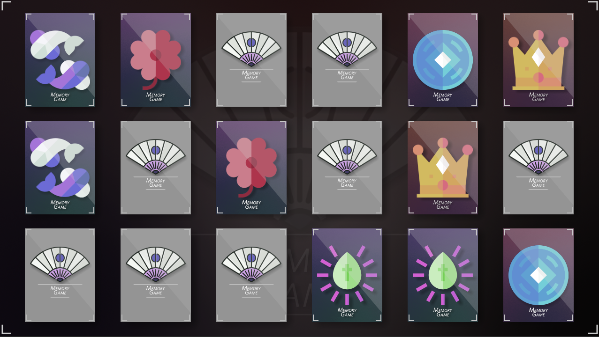

# Ohjelmistotekniikka, harjoitustyö

# Python Muistipeli

Sovellus on perinteinen muistipeli, joka on rakennettu pygame-kirjastolla.

[Final Release](https://github.com/VoxBorealis/ot-harjoitustyo/releases/tag/1.0)

## Dokumentaatio

[Vaatimusmäärittely](https://github.com/VoxBorealis/ot-harjoitustyo/blob/main/dokumentaatio/vaatimusmaarittely.md)

[Työaikakirjanpito](https://github.com/VoxBorealis/ot-harjoitustyo/blob/main/dokumentaatio/tuntikirjanpito.md)

[Käyttöohje](https://github.com/VoxBorealis/ot-harjoitustyo/blob/main/dokumentaatio/kayttoohje.md)

[Arkkitehtuuri](https://github.com/VoxBorealis/ot-harjoitustyo/blob/main/dokumentaatio/arkkitehtuuri.md)




## Asennus

1. Asenna riippuuvuudet komennolla:

```bash
poetry install
```

2. Käynnistä peli komennolla:

```bash
poetry run invoke start
```

### Testaus

Testit suoritetaan komennolla:

```bash
poetry run invoke test
```

### Testikattavuus

Testikattavuusraportin voi generoida komennolla:

```bash
poetry run invoke coverage-report
```

Raportti generoituu _htmlcov_-hakemistoon.

### Pylint

Pylint testin voi suorittaa komennolla:

```bash
poetry run invoke lint
```
